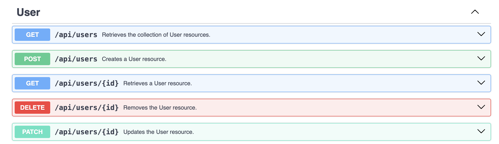
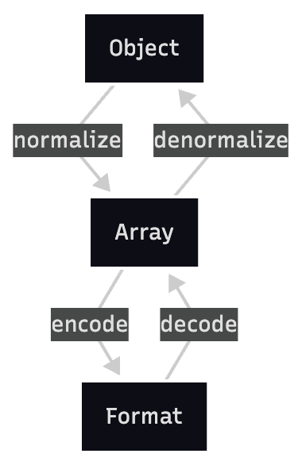

# API Platform & Serializer

> Jocelyn & Ethan

---

###### Niveau -1
#### Avant de parler d'Api Platform
## C'est quoi une Api Rest ?

Une API REST est une interface qui permet à des applications de communiquer sur le web via le protocole HTTP en utilisant des URL et des méthodes HTTP.

> En gros : c’est une manière standard de rendre des ressources accessibles via HTTP.

---

###### Niveau -1
#### Api Platform
## C'est quoi API Platform ?

Api Platform est un framework conçu pour créer des API REST, construit au dessus de Symfony. Il est adapté uniquement à Symfony et Laravel.

> Durant ces slides, nous allons nous concentré sur la partie Rest de API Platform, nous n'avons pas les compétences nécessaires pour parler de la partie GraphQL

---

###### Niveau -1
#### Api Platform
## Philosophie

* Permettre aux développeurs de pouvoir connecter leur techno front préféré sur Symfony sans rajout de surcouches
* Création automatique de documentation et respect des standards
* Automatisation, productivité et Extensibilité

<a href="https://api-platform.com/docs/extra/philosophy/" style="font-size:16px; margin-top:8px;">sources</a>

---

###### Niveau 0
#### Api Platform
## Qu'est ce que ça fait concrètement ?

Api Platform permet d’exposer des entités via une API publique et de générer une documentation Swagger en quelques minutes.



---

###### Niveau 0
#### Api Platform
## Comment on l'installe ?

L'installation d'API Platform dans Symfony se résume à une commande

```sh
composer require api
```

<a href="https://api-platform.com/docs/core/getting-started/" style="font-size:16px; margin-top:8px;">sources</a>

---

###### Niveau 0
##### Api Platform
## Comment on le fait concrètement ?

Il suffit d'un simple changement sur une entité pour la rendre publique dans l'api.

<div style="display: flex; justify-content: space-between;">

<div style="width: 45%;">

> Avant

```php
#[ORM\Entity(...)]
class User{

}
# 
```

</div>

<div style="width: 45%;">

> Après

```php
#[ORM\Entity(...)]
#[ApiResource]
class User{

}
```

</div>

</div>

<a href="https://api-platform.com/docs/core/getting-started/" style="font-size:16px; margin-top:8px;">sources</a>

---

###### Niveau 0
##### Api Platform
## Les possibilités et les attributs

```php
#[ApiResource(
    paginationItemsPerPage: 30 # <-- Pagination
    )]
class Book{

}
```

--- 

###### Niveau 1
#### Api Platform
## Sélectionner les opérations possibles.

Il est possible de sélectionner les opérations qu'on souhaite pouvoir réaliser depuis l'API.

```php
#[ORM\Entity(...)]
#[ApiResource(operations: [
    new Get() # <-------- Permet d'ajouter uniquement 
    #                    l'opération GET dans l'entity
    ])] 
class User{

}
```

--- 

###### Niveau 1
#### Api Platform
## Custom Controller - Explication

Il est possible aussi d'insérer un controller custom pour modifier le comportement d'une opération.

--- 

###### Niveau 1
#### Api Platform
## Custom Controller - Exemple
<div style="font-size:32px">

```php

#[AsController]
class RegisterController extends AbstractController
{
    public function __invoke(Request $request, ...) { ... }
}

#[ORM\Entity(...)]
#[ApiResource(operations: [
    new Post(
        uriTemplate: '/register',
        controller: RegisterController::class, # <-- Utilisera le controller déclaré plus haut
        name: 'register'
    )])]
class User {
    ...
}
```

</div>

--- 

###### Niveau 1
#### Api Platform
## Paramétrer les opérations possibles.

Il est possible de paramétrer les opérations qu'on souhaite pouvoir réaliser depuis l'API.

```php
#[ORM\Entity(...)]
#[ApiResource(operations: [
    new Get(
        uriTemplate: '/user/{email}', 
        uriVariables: ['email' => 'email'],
        # Permet de mapper l'opération get à la propriété email de l'entité
    )
    ])] 
class User{
    public ?string $email = null;
    ...
}
```

---

###### Niveau 2
#### Api Platform
## Les Data Providers - Explication

Un Data Provider est un service qui récupère les données pour une ressource donnée lorsqu’une requête API est faite.

> Il peut être particulièrement utile dans le cas où on veut récuperer des données en fonction d'un utilisateur

---

###### Niveau 2
#### Api Platform
## Les Data Providers - Exemple

```php
class BookProvider implements ProviderInterface # <-- Déclare le provider
{
    public function __construct(...) {}

    public function provide(...): object|array|null
    {
        $user = $this->security->getUser();
        return $this->entityManager->getRepository(Book::class)
            ->findBy(['owner' => $user]);
    }
}

#[ApiResource(operations: [
    new GetCollection(provider: BookProvider::class) # <-- Utilise le provider
])]
class Book {
    public User $owner = null;
}
```

--- 
#### Serializer
## Qu'est ce que c'est que la Serialization ?

* Sérialisation = transformer un objet PHP en format que l’ordinateur peut envoyer ou stocker, comme JSON ou XML.

* Désérialisation = l’inverse : transformer des données reçues (JSON, XML…) en objet PHP.

--- 
#### Serializer
## Api Platform et Serialization


--- 
#### Serializer
## Api Platform et Serialization

Serialization des données


